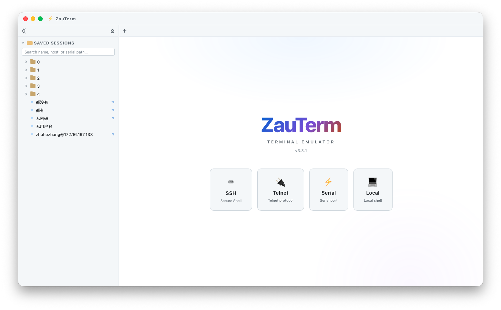
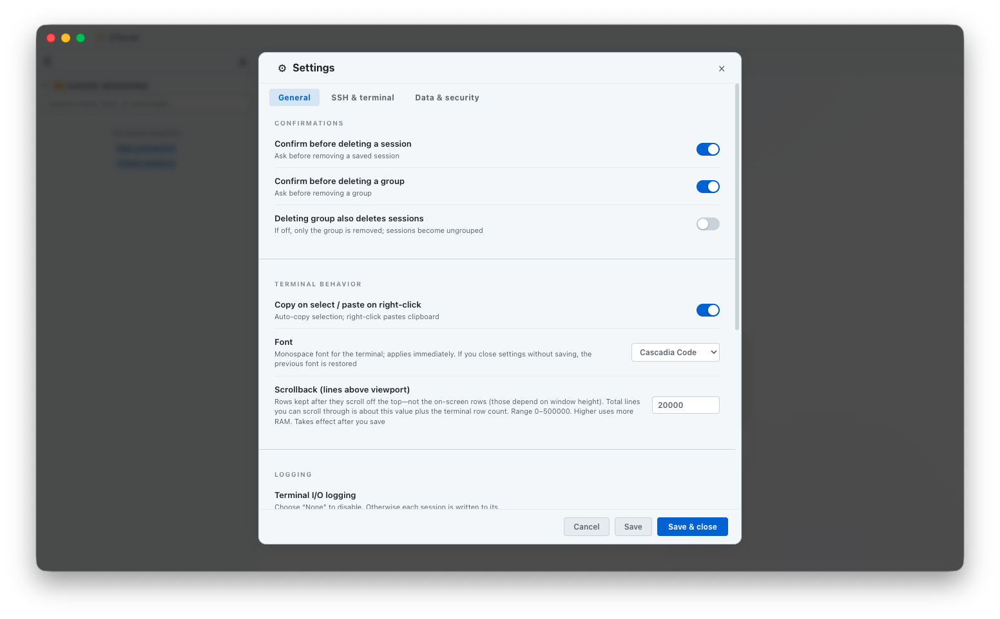
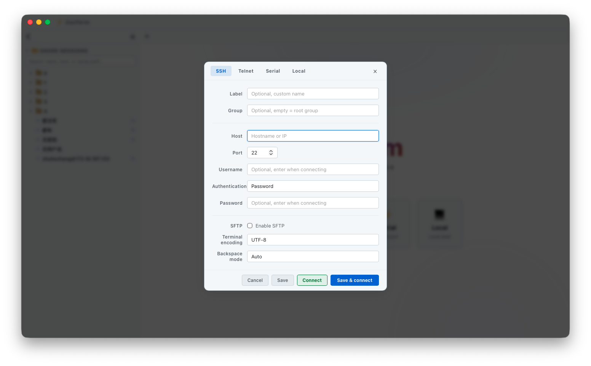

# ZauTerm

**[简体中文](README.zh-CN.md)** · English · v3.3.0

ZauTerm is a cross-platform desktop terminal emulator built with **Tauri 2**, **React**, and **xterm.js**. It supports **SSH**, **SFTP**, **Telnet**, and **Serial** connections, with saved sessions, hierarchical grouping, encrypted credential storage, and a polished custom UI (overlay title bar, dark/light themes, bilingual interface).

> Successor to the Electron-based [ZenTerm](https://github.com/zhuhezhang/zenterm) app: same product features, Rust/Tauri backend.

---

## Table of Contents

- [Features](#features)
- [Keyboard Shortcuts](#keyboard-shortcuts)
- [Screenshots](#screenshots)
- [Tech Stack](#tech-stack)
- [Project Structure](#project-structure)
- [Requirements](#requirements)
- [Quick Start](#quick-start)
- [Development & Quality](#development--quality)
- [Build & Release](#build--release)
- [Import / Export Format](#import--export-format)
- [Security Model](#security-model)
- [Data & Storage Locations](#data--storage-locations)
- [Troubleshooting](#troubleshooting)
- [License](#license)

---

## Features

### Connection types

| Protocol   | Description                                                                                                                                  |
| ---------- | -------------------------------------------------------------------------------------------------------------------------------------------- |
| **SSH**    | Interactive shell via `ssh2` (Rust), PTY resize, password or private-key auth (in-memory PEM; no temp key files), keepalive                   |
| **SFTP**   | File browser in the sidebar: list, upload, download, mkdir, rename, delete; progress events; local paths restricted to safe user directories |
| **Telnet** | Raw TCP Telnet client                                                                                                                        |
| **Serial** | Local serial ports via `serialport` (baud rate, data/stop bits, parity); port list must be chosen from enumerated devices                    |

### Session management

- Save sessions with **label**, **group** (hierarchical paths), and connection parameters
- **Empty group placeholders** — create folder-like groups before adding sessions
- **Search** saved sessions by name, host, or serial path (**Ctrl/Cmd+F**)
- **Duplicate**, **rename**, **edit**, **delete** sessions; optional confirm dialogs
- **Export / import** session lists (JSON envelope, v1); import from **Settings** or the **sidebar**
- **Connect**, **Save & connect**, or **Save only** from the connection dialog
- **Credential prompt** on connect when secrets are not stored; optional **“Save & connect”** to update vault

### Terminal experience

- **xterm.js** with Fit, Web Links, and Search addons; configurable scrollback (0–500,000 lines) and **terminal font** presets (Cascadia Code, JetBrains Mono, Fira Code, Menlo, Consolas, Source Code Pro, Courier New)
- **Press R to reconnect** after a session disconnects or an initial connection fails
- **In-terminal search**: incremental find with match highlighting; **case sensitive**, **whole word**, and **regex** modes; prev/next navigation; open via tab context menu or **Ctrl/Cmd+Shift+F**
- **Character encodings**: UTF-8, GBK, GB18030, GB2312, Big5, UTF-16 LE, Latin-1 (Rust `encoding_rs` on the backend; `TextDecoder` in the webview)
- **Backspace mode** (per session): Auto (DEL for SSH, BS for Telnet/Serial), or force DEL / BS
- **Terminal interaction**: select-to-copy and right-click paste (toggle in settings)
- **Output highlighting**: regex rules with colors (defaults for error/success/warning/IP)
- **Tab bar**: new connection, close tab/others/left/right/all, clear screen, save terminal output to file
- **Session logging**: off, buffer (matches screen), or stream (raw downstream, ANSI stripped); log path validated against allowed directories

### UI & i18n

- Custom **overlay title bar** (minimize / maximize / close); click the **⚡ ZauTerm** logo to open **About**
- **Dark**, **light**, or **auto** theme (follows OS); **live preview** in Settings before saving
- **UI language**: English, 简体中文, or auto (follows system)
- Resizable **sidebar** for saved sessions and SFTP tree
- **Settings dialog** organized into General, SSH & Terminal, and Data & Security tabs

### Security-related behavior

- Webview uses Tauri **isolation** pattern + CSP; invoke surface allowlisted in `src-isolation/`
- Capabilities use **least privilege** (no broad `fs:` / `opener:` frontend permissions)
- **SSH host key verification** (`zauterm-known-hosts.json`); prompts on first connect and fingerprint change
- Optional **encrypted vault** for passwords and keys (ChaCha20-Poly1305; master key in OS keyring)
- **Local path policy** for logs and SFTP: home, Documents, Downloads, Desktop, Music/Pictures/Videos, app data; on Windows, non-system drive roots (e.g. `D:\`) are also allowed

---

## Keyboard Shortcuts

Global shortcuts work when ZauTerm is focused. On macOS use **Cmd**; on Windows and Linux use **Ctrl**.

| Shortcut | Action |
| -------- | ------ |
| **Ctrl/Cmd+F** | Focus sidebar **saved session search** (expands the session list if collapsed) |
| **Ctrl/Cmd+Shift+F** | Open **in-terminal search** on the active tab |
| **Ctrl/Cmd+0** | Reset zoom to default |
| **Ctrl/Cmd+-** | Zoom out |
| **Ctrl/Cmd++** | Zoom in |
| **Enter** / **Shift+Enter** | Next / previous match (in terminal search bar) |
| **Esc** | Close terminal search bar |
| **R** | Reconnect the active terminal session (when disconnected or after a failed connect) |

---

## Screenshots







---

## Tech Stack

| Layer         | Technology                                      |
| ------------- | ----------------------------------------------- |
| Desktop shell | Tauri 2                                         |
| Backend       | Rust (`ssh2`, `serialport`, `encoding_rs`, …)   |
| Frontend      | TypeScript, React 19, Vite 6                    |
| Terminal      | @xterm/xterm 5, Fit / Web Links / Search addons |
| Crypto        | ChaCha20-Poly1305 + OS keyring                  |
| Testing       | Vitest 3 (frontend), `cargo test` (Rust)        |
| Packaging     | `tauri build`                                   |

---

## Project Structure

Source is organized as **frontend / Rust backend / isolation hook**:

| Directory | Role | Description |
|-----------|------|-------------|
| **`src/`** | Frontend | React webview: UI, xterm, localStorage, `window.zauterm` bridge |
| **`src-tauri/`** | Backend | Tauri/Rust: commands, SSH/SFTP/Telnet/Serial, vault, path policy |
| **`src-isolation/`** | IPC gate | Isolation hook allowlisting invoke commands |

```
zauterm/
├── src/                                 # Frontend (webview)
│   ├── main.tsx, App.tsx
│   ├── components/                      # Title bar, sidebar, terminal, SFTP, connect/settings dialogs
│   ├── store/                           # sessionStore, settingsStore, credentialsBridge
│   ├── lib/                             # Import/export, IPC (`tauriZauterm`), session/terminal/settings
│   ├── hooks/, context/, i18n/, theme/, styles/, types/
│
├── src-tauri/                           # Backend (Rust)
│   ├── src/
│   │   ├── lib.rs, main.rs              # App entry, generate_handler!
│   │   ├── commands/                    # window / app / log / credentials / ssh / sftp / telnet / serial
│   │   ├── ssh/, sftp/, telnet/, serial/
│   │   ├── path_policy/, known_hosts/, vault/
│   │   ├── invoke_commands.rs           # Canonical IPC command list (synced with isolation)
│   │   ├── ssh_key.rs                   # In-memory pubkey auth
│   │   └── encoding/, ipc.rs, dialogs/, …
│   ├── capabilities/default.json        # Least-privilege permissions
│   ├── tauri.conf.json                  # + platform overlays
│   └── Cargo.toml
│
├── src-isolation/                       # Isolation hook (ALLOWED_CMDS / ALLOWED_PLUGIN_CMDS)
├── tests/                               # Vitest unit tests (tests/**/*.test.ts)
├── docs/images/                         # README screenshots
├── build/, public/                      # Icons / static assets
├── tsconfig.json                        # TS for app code: src/ + tests/ (DOM, JSX, @/*)
├── tsconfig.node.json                   # TS for Node tooling: vite.config.ts, vitest.config.ts
├── index.html, vite.config.ts, vitest.config.ts, eslint.config.js
└── package.json
```

**TypeScript configs:** `tsconfig.json` typechecks the React/webview app and unit tests (`include`: `src`, `tests`; enables DOM libs, `react-jsx`, and the `@/*` path alias). `tsconfig.node.json` typechecks Vite/Vitest config files that run in Node (no DOM/JSX). `npm run typecheck` runs both.

**Runtime data flow (simplified):**

```
Frontend src/ (React / xterm)
    │  window.zauterm  ←  src/lib/ipc/tauriZauterm.ts (invoke / listen)
    │  isolation hook (src-isolation/)
    ▼
Backend src-tauri/ (commands + protocol modules)
    ▼
Remote host / local serial / OS keyring
```

---

## Requirements

- **Node.js** 18+ (LTS recommended)
- **npm** 9+
- **Rust** stable toolchain (`rustup`; edition 2021)
- **Platform native deps** (Tauri):
  - **macOS**: Xcode Command Line Tools
  - **Windows**: Visual Studio Build Tools (MSVC), WebView2
  - **Linux**: see [Tauri Linux prerequisites](https://v2.tauri.app/start/prerequisites/) (e.g. `webkit2gtk`, `libudev` for Serial)

---

## Quick Start

```bash
# GitHub
git clone https://github.com/zhuhezhang/zauterm.git
cd zauterm

# or Gitee
# git clone https://gitee.com/zhuhezhang/zauterm.git
# cd zauterm

npm install
npm run tauri:dev
```

This starts **Vite** (port **5173**) and the **Tauri** app (`beforeDevCommand` runs `npm run dev`). Frontend hot-reloads via Vite; Rust changes rebuild the host.

| Script | Description |
| --- | --- |
| `npm run dev` | Vite only (port 5173) |
| `npm run tauri:dev` | Full desktop app (Vite + Tauri) |
| `npm run tauri` | Pass-through to `@tauri-apps/cli` |

---

## Development & Quality

Before merging, run locally:

```bash
npm run typecheck
npm run lint
npm run test              # Vitest, tests/**/*.test.ts
npm run cargo:check       # cd src-tauri && cargo check
npm run cargo:test        # Rust unit tests (path policy, vault, known_hosts, isolation sync, …)
# or all of the above:
npm run project:check
```

| Script | Description |
| --- | --- |
| `npm run test:watch` | Vitest watch mode |
| `npm run cargo:test` | `cd src-tauri && cargo test` |
| `npm run project:check` | typecheck + lint + test + cargo:check + cargo:test |

---

## Build & Release

```bash
npm run tauri:build       # current platform → rename artifacts in bundle/
```

Tauri writes packages under `src-tauri/target/release/bundle/`. After build, `scripts/rename-tauri-artifacts.mjs` inserts the OS name between version and arch **in place** (keeps `_` and Tauri’s arch tokens):

| Platform | Example |
| --- | --- |
| Windows | `ZauTerm_{version}_win_x64-setup.exe`, `ZauTerm_{version}_win_x64_en-US.msi`, **`ZauTerm_{version}_win_x64-portable.exe`** (no-install copy of the main binary) |
| Linux | `ZauTerm_{version}_linux_amd64.AppImage`, `.deb`, … |
| macOS | `ZauTerm_{version}_mac_aarch64.dmg` |

On Windows, Tauri has no official “portable” target; the post-build script copies `target/release/ZauTerm.exe` to `bundle/portable/`. The portable build still requires **WebView2** on the target PC (usually preinstalled on Windows 10/11).


The main binary / app bundle name is **`ZauTerm`** (`mainBinaryName` in `tauri.conf.json`).

Re-run renaming only (if needed): `npm run rename:artifacts`.

Keep the version in sync across `package.json`, `src-tauri/Cargo.toml`, `src-tauri/tauri.conf.json`, `README.md`, and `README.zh-CN.md`:

```bash
npm run mod:ver -- x.x.x
```

---

## Import / Export Format

Exported **sessions** and **settings** use a versioned JSON envelope (max file size **8 MB**):

```json
{
  "zautermExport": "sessions",
  "version": 1,
  "exportedAt": "Mon May 19 2026 ...",
  "data": [ /* session objects or settings object */ ]
}
```

- `zautermExport` must be `"sessions"` or `"settings"` (cross-import is rejected).
- `version` must be `1`.
- Unknown settings keys are stripped on import; invalid sessions are skipped with a summary alert.
- Session imports are capped at **99999** entries per file (see `src/lib/import/constants.ts`).

---

## Security Model

1. **Isolation + allowlist**: Frontend IPC is filtered by `src-isolation/index.js`; app commands must match `src-tauri/src/invoke_commands.rs` (enforced by Rust tests).
2. **Least-privilege capabilities**: `capabilities/default.json` grants only needed window/event/dialog permissions—not broad filesystem/opener defaults.
3. **SSH MITM mitigation**: Host keys are recorded; unknown or changed fingerprints require confirmation in a native dialog.
4. **Private keys in memory**: SSH/SFTP pubkey auth uses `userauth_pubkey_memory` (no temp PEM files under `/tmp`).
5. **Path sandboxing**: Session logs and SFTP local paths must resolve under allowed user folders or app data (plus Windows non-system drive roots).
6. **Serial safety**: Connect only accepts paths returned by `listPorts` (refreshed list).
7. **Credential vault**: Secrets encrypted with ChaCha20-Poly1305; master key stored via OS keyring (`keyring` crate).

This app is a convenience tool, not a full security audit. Review your threat model before storing production keys in the vault.

---

## Data & Storage Locations

| Data                        | Location                                                |
| --------------------------- | ------------------------------------------------------- |
| Saved sessions (no secrets) | `localStorage` → `zauterm_saved_sessions`                 |
| Empty group placeholders    | `localStorage` → `__zauterm_group_placeholders__`         |
| App settings                | `localStorage` → `zauterm_settings`                       |
| SSH known hosts             | `{appData}/zauterm-known-hosts.json` (pretty JSON, atomic rewrite) |
| Encrypted credentials       | `{appData}/zauterm-credentials-vault.json` + OS keyring   |
| Session logs                | User-configured or Downloads / `zauterm-session-log/`     |

Typical **app data** paths:

- **macOS**: `~/Library/Application Support/zauterm/`
- **Windows**: `%APPDATA%\zauterm\`
- **Linux**: `~/.config/zauterm/`

---

## Troubleshooting

| Issue | Suggestions |
| ----- | ----------- |
| `npm run tauri:dev` fails on Rust deps | Install Rust via `rustup`; ensure platform Tauri prerequisites |
| SSH algorithm / auth mismatch | Check username/key/passphrase; enable server-required options if exposed in settings |
| Garbled Chinese output | Set session encoding to **GBK** or **GB18030** |
| SFTP “path not allowed” | Choose a directory under Downloads/Documents/home, not system paths |
| Serial port not listed | Click **Refresh**; on Linux ensure user is in `dialout` group |
| Host key prompt every time | Check write permissions for app data; do not run from read-only profiles |
| Import fails / wrong file type | Use the correct export file (`sessions` vs `settings`); max 8 MB |
| Isolation / invoke blocked | New commands must be added to `lib.rs`, `invoke_commands.rs`, and `src-isolation/index.js` |
| **Ctrl/Cmd+Shift+F** doesn't open in-terminal search | IME may capture the shortcut; remap IME or use tab context menu → Search terminal |

---

## License

[MIT License](LICENSE) — Copyright © 2026 [zhuhezhang](https://github.com/zhuhezhang)

---

**中文文档：** [README.zh-CN.md](README.zh-CN.md)
