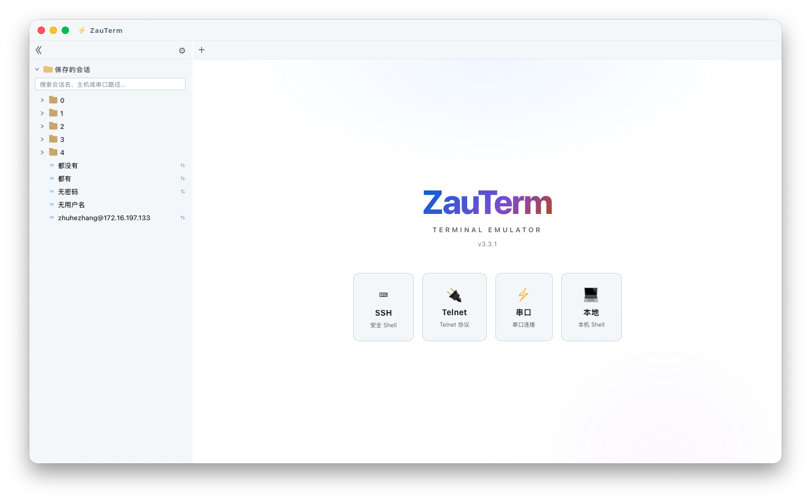
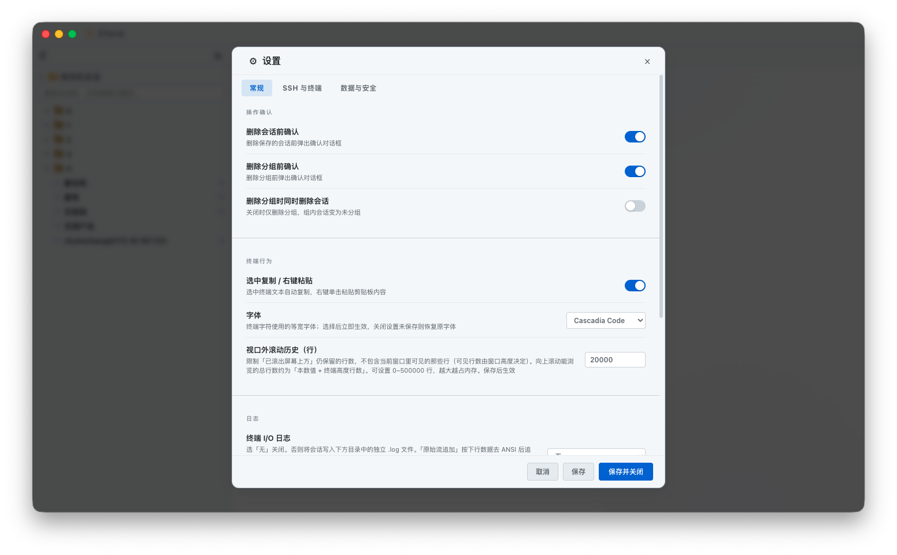
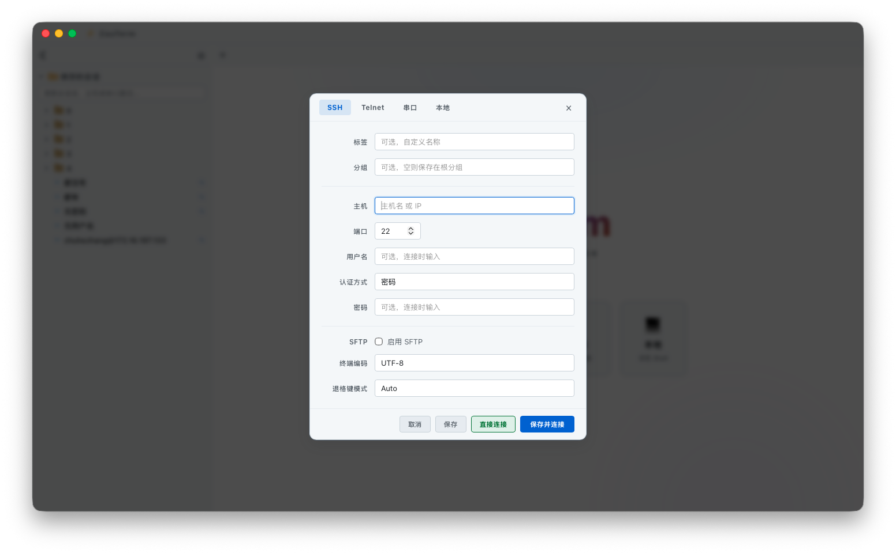

# ZauTerm

简体中文 · **[English](README.md)** · v3.3.1

ZauTerm 是一款基于 **Tauri 2**、**React** 与 **xterm.js** 的跨平台桌面终端模拟器。支持 **SSH**、**SFTP**、**Telnet**、**串口（Serial）** 与 **本地（Local）** Shell 连接，并提供会话保存、层级分组、加密凭据存储，以及自定义界面（覆盖式标题栏、深色/浅色主题、中英双语）。

> 由 Electron 版 [ZenTerm](https://github.com/zhuhezhang/zenterm) 演进而来：产品能力对齐，后端改为 Rust / Tauri。

---

## 目录

- [功能特性](#功能特性)
- [键盘快捷键](#键盘快捷键)
- [界面预览](#界面预览)
- [技术栈](#技术栈)
- [项目结构](#项目结构)
- [环境要求](#环境要求)
- [快速开始](#快速开始)
- [开发与质量](#开发与质量)
- [构建与发布](#构建与发布)
- [导入 / 导出格式](#导入--导出格式)
- [安全设计](#安全设计)
- [数据与存储位置](#数据与存储位置)
- [常见问题](#常见问题)
- [许可证](#许可证)

---

## 功能特性

### 连接类型

| 协议         | 说明                                                                 |
| ---------- | -------------------------------------------------------------------- |
| **SSH**    | 基于 Rust `ssh2` 的交互式 Shell，支持 PTY 尺寸同步、密码或私钥认证（内存 PEM，无临时密钥文件）、keepalive |
| **SFTP**   | 侧边栏远程文件管理：列表、上传、下载、新建目录、重命名、删除；传输进度；本地路径限制在安全用户目录内 |
| **Telnet** | 原生 TCP Telnet 客户端                                                   |
| **Serial** | 通过 `serialport` 访问本地串口（波特率、数据位、停止位、校验位）；须从枚举列表中选择端口 |
| **Local**  | 本机交互式 Shell（`portable-pty`：Unix PTY / Windows ConPTY）；可选 Shell 路径与工作目录（默认 `$SHELL` / `COMSPEC`、用户主目录）；支持 PTY 尺寸同步 |

### 会话管理

- 保存会话：**标签名**、**分组**（层级路径）、连接参数
- **空分组占位**：可先创建文件夹式分组，再向其中添加会话
- **搜索**已保存会话（按名称、主机、串口路径或本地 Shell；**Ctrl/Cmd+F** 聚焦搜索框）
- **复制**、**重命名**、**编辑**、**删除**；可配置删除确认
- **导出 / 导入**会话列表（JSON envelope，v1）；可在 **设置** 或 **侧边栏** 中导入
- 连接对话框支持 **直接连接**、**保存并连接**、**仅保存**
- 连接时可弹出 **凭据输入**；支持 **「保存并连接」** 写入加密库

### 终端体验

- **xterm.js**，含 Fit、Web Links、Search 插件，可配置回滚行数（0～500,000）与 **终端字体** 预设（Cascadia Code、JetBrains Mono、Fira Code、Menlo、Consolas、Source Code Pro、Courier New）
- 会话断开或 **初次连接失败** 后，在终端内按 **R** 可 **快速重连**
- **终端内搜索**：增量查找并高亮匹配；支持 **区分大小写**、**全字匹配**、**正则表达式**；上/下跳转；可通过标签右键菜单或 **Ctrl/Cmd+Shift+F** 打开
- **字符编码**：UTF-8、GBK、GB18030、GB2312、Big5、UTF-16 LE、Latin-1（后端 `encoding_rs`；前端 `TextDecoder`）
- **退格键模式**（按会话）：自动（SSH/Local 发 DEL，Telnet/串口发 BS），或强制 DEL / BS
- **终端交互**：选中复制、右键粘贴（可在设置中关闭）
- **输出高亮**：正则规则着色（内置错误/成功/警告/IP 等默认规则）
- **标签栏**：新建连接、关闭当前/其他/左侧/右侧/全部、清屏、保存终端输出
- **会话日志**：关闭 / 缓冲模式（与屏幕一致）/ 流模式（原始下行，去除 ANSI）；日志目录经路径策略校验

### 界面与国际化

- 自定义 **覆盖式标题栏**（最小化 / 最大化 / 关闭）；点击 **⚡ ZauTerm** 徽标打开 **关于** 对话框
- **深色**、**浅色** 或 **跟随系统** 主题；设置中支持 **实时预览**（保存前生效）
- **界面语言**：简体中文、English 或自动跟随系统
- 可拖拽调整 **侧边栏** 宽度（会话列表与 SFTP 树）
- **设置对话框** 分为「常规」「SSH 与终端」「数据与安全」三个标签页

### 安全相关能力

- Webview 启用 Tauri **isolation** 模式与 CSP；invoke 命令由 `src-isolation/` 白名单拦截
- Capabilities **最小权限**（前端不授予宽泛的 `fs:` / `opener:`）
- **SSH 主机公钥校验**（`zauterm-known-hosts.json`）；首次连接与指纹变更时弹窗确认
- 可选 **加密凭据库**（ChaCha20-Poly1305；主密钥存 OS keyring）
- 日志、SFTP 与 Local 会话工作目录的 **本地路径策略**：用户主目录、文档、下载、桌面、音乐/图片/视频、应用数据目录；Windows 上另允许非系统盘根目录（如 `D:\`）

---

## 键盘快捷键

在 ZauTerm 窗口获得焦点时生效。macOS 使用 **Cmd**；Windows / Linux 使用 **Ctrl**。

| 快捷键                         | 作用                             |
| --------------------------- | ------------------------------ |
| **Ctrl/Cmd+F**              | 聚焦侧边栏 **已保存会话搜索**（若列表已收起则自动展开） |
| **Ctrl/Cmd+Shift+F**        | 打开当前标签页的 **终端内容搜索**            |
| **Ctrl/Cmd+0**              | 恢复默认缩放大小                       |
| **Ctrl/Cmd+-**              | 缩小                             |
| **Ctrl/Cmd++**              | 放大                             |
| **Enter** / **Shift+Enter** | 下一个 / 上一个匹配（终端搜索栏内）            |
| **Esc**                     | 关闭终端搜索栏                        |
| **R**                       | 重连当前终端会话（已断开或初次连接失败时）          |

---

## 界面预览







---

## 技术栈

| 层级         | 技术                                              |
| ---------- | ----------------------------------------------- |
| 桌面壳        | Tauri 2                                         |
| 后端         | Rust（`ssh2`、`serialport`、`portable-pty`、`encoding_rs` 等） |
| 前端         | TypeScript、React 19、Vite 6                      |
| 终端         | @xterm/xterm 5、Fit / Web Links / Search 插件     |
| 加密         | ChaCha20-Poly1305 + OS keyring                  |
| 测试         | Vitest 3（前端）、`cargo test`（Rust）                |
| 打包         | `tauri build`                                   |

---

## 项目结构

源码按 **前端 / Rust 后端 / isolation 钩子** 划分：

| 目录               | 角色    | 说明                                                      |
| ---------------- | ----- | ------------------------------------------------------- |
| `src/`           | 前端    | React Webview：UI、xterm、localStorage、`window.zauterm` 桥接 |
| `src-tauri/`     | 后端    | Tauri/Rust：commands、SSH/SFTP/Telnet/Serial/Local、vault、路径策略 |
| `src-isolation/` | IPC 闸门 | Isolation hook，白名单过滤 invoke 命令                          |

```
zauterm/
├── src/                                 # 前端（Webview）
│   ├── main.tsx, App.tsx
│   ├── components/                      # 标题栏、侧边栏、终端、SFTP、连接/设置对话框
│   ├── store/                           # sessionStore、settingsStore、credentialsBridge
│   ├── lib/                             # 导入导出、IPC（tauriZauterm）、会话/终端/设置逻辑
│   ├── hooks/, context/, i18n/, theme/, styles/, types/
│
├── src-tauri/                           # 后端（Rust）
│   ├── src/
│   │   ├── lib.rs, main.rs              # 应用入口、generate_handler!
│   │   ├── commands/                    # window / app / log / credentials / ssh / sftp / telnet / serial / local
│   │   ├── ssh/, sftp/, telnet/, serial/, local/
│   │   ├── path_policy/, known_hosts/, vault/
│   │   ├── invoke_commands.rs           # IPC 命令权威列表（与 isolation 同步）
│   │   ├── ssh_key.rs                   # 内存公钥认证
│   │   └── encoding/, ipc.rs, dialogs/, …
│   ├── capabilities/default.json        # 最小权限
│   ├── tauri.conf.json                  # + 各平台 overlay
│   └── Cargo.toml
│
├── src-isolation/                       # Isolation hook（ALLOWED_CMDS / ALLOWED_PLUGIN_CMDS）
├── tests/                               # Vitest 单元测试（tests/**/*.test.ts）
├── docs/images/                         # README 截图
├── build/, public/                      # 图标 / 静态资源
├── tsconfig.json                        # 应用 TS：src/ + tests/（DOM、JSX、@/*）
├── tsconfig.node.json                   # 工具链 TS：vite.config.ts、vitest.config.ts（Node）
├── index.html, vite.config.ts, vitest.config.ts, eslint.config.js
└── package.json
```

**TypeScript 配置：** `tsconfig.json` 负责前端应用与单测的类型检查（`include`：`src`、`tests`；开启 DOM、`react-jsx`、`@/*` 路径别名）。`tsconfig.node.json` 负责在 Node 中运行的 Vite/Vitest 配置文件（不含 DOM/JSX）。`npm run typecheck` 会跑这两套配置。

**运行时数据流（简图）：**

```
前端 src/（React / xterm）
    │  window.zauterm  ←  src/lib/ipc/tauriZauterm.ts（invoke / listen）
    │  isolation hook（src-isolation/）
    ▼
后端 src-tauri/（commands + 协议模块）
    ▼
远程主机 / 本地串口 / 本机 Shell（PTY） / OS keyring
```

---

## 环境要求

- **Node.js** 18+（建议 LTS）
- **npm** 9+
- **Rust** 稳定版工具链（`rustup`；edition 2021）
- **各平台原生依赖**（Tauri）：
  - **macOS**：Xcode Command Line Tools
  - **Windows**：Visual Studio Build Tools（MSVC）、WebView2
  - **Linux**：见 [Tauri Linux 前置条件](https://v2.tauri.app/start/prerequisites/)（如 `webkit2gtk`；串口需 `libudev`）

---

## 快速开始

```bash
# GitHub
git clone https://github.com/zhuhezhang/zauterm.git
cd zauterm

# 或 Gitee
# git clone https://gitee.com/zhuhezhang/zauterm.git
# cd zauterm

npm install
npm run tauri:dev
```

将启动 **Vite**（端口 **5173**）与 **Tauri** 应用（`beforeDevCommand` 会执行 `npm run dev`）。前端由 Vite 热更新；Rust 改动会触发宿主重编译。

| 脚本                   | 说明                        |
| -------------------- | ------------------------- |
| `npm run dev`        | 仅 Vite（5173）              |
| `npm run tauri:dev`  | 完整桌面应用（Vite + Tauri）      |
| `npm run tauri`      | 透传 `@tauri-apps/cli`      |

---

## 开发与质量

合并前建议本地执行：

```bash
npm run typecheck
npm run lint
npm run test              # Vitest，tests/**/*.test.ts
npm run cargo:check       # cd src-tauri && cargo check
npm run cargo:test        # Rust 单元测试（路径策略、vault、known_hosts、isolation 同步等）
# 或一次跑完：
npm run project:check
```

| 脚本                      | 说明                                          |
| ----------------------- | ------------------------------------------- |
| `npm run test:watch`    | Vitest 监听模式                                 |
| `npm run cargo:test`    | `cd src-tauri && cargo test`                |
| `npm run project:check` | typecheck + lint + test + cargo:check + cargo:test |

---

## 构建与发布

```bash
npm run tauri:build       # 当前平台 → 在 bundle/ 内重命名产物
```

Tauri 写入 `src-tauri/target/release/bundle/`。构建结束后，`scripts/rename-tauri-artifacts.mjs` 会在版本号与架构之间**原地**插入系统名（保留 `_` 与 Tauri 原架构名）：

| 平台 | 示例 |
| --- | --- |
| Windows | `ZauTerm_{version}_win_x64-setup.exe`、`ZauTerm_{version}_win_x64_en-US.msi`、**`ZauTerm_{version}_win_x64-portable.exe`**（免安装主程序副本） |
| Linux | `ZauTerm_{version}_linux_amd64.AppImage`、`.deb` 等 |
| macOS | `ZauTerm_{version}_mac_aarch64.dmg` |

Windows 上 Tauri 没有官方 portable 目标；构建脚本会把 `target/release/ZauTerm.exe` 复制到 `bundle/portable/`。便携版仍依赖目标机器已安装 **WebView2**（Win10/11 通常自带）。


主程序 / 应用包名称为 **`ZauTerm`**（`tauri.conf.json` 的 `mainBinaryName`）。

仅重新执行重命名：`npm run rename:artifacts`。

版本号需在 `package.json`、`src-tauri/Cargo.toml`、`src-tauri/tauri.conf.json`、`README.md`、`README.zh-CN.md` 五处保持一致，可用：

```bash
npm run mod:ver -- x.x.x
```

---

## 导入 / 导出格式

导出的 **会话** 与 **设置** 使用带版本号的 JSON envelope（单文件上限 **8 MB**）：

```json
{
  "zautermExport": "sessions",
  "version": 1,
  "exportedAt": "Mon May 19 2026 ...",
  "data": [ /* 会话对象数组或设置对象 */ ]
}
```

- `zautermExport` 须为 `"sessions"` 或 `"settings"`（类型不匹配会报错）。
- `version` 须为 `1`。
- 导入设置时会剥离未知键；无效会话条目会跳过并在完成后提示统计。
- 单次会话导入上限 **99999** 条（见 `src/lib/import/constants.ts`）。

---

## 安全设计

1. **Isolation + 白名单**：前端 IPC 经 `src-isolation/index.js` 过滤；应用命令须与 `src-tauri/src/invoke_commands.rs` 一致（由 Rust 测试强制）。
2. **最小权限 Capabilities**：`capabilities/default.json` 仅授予所需的窗口/事件/对话框权限，不含宽泛的文件系统/opener 默认权限。
3. **SSH 中间人防护**：记录主机公钥；未知或变更指纹需用户在原生对话框中确认。
4. **私钥内存认证**：SSH/SFTP 公钥认证使用 `userauth_pubkey_memory`（不在临时目录落盘 PEM）。
5. **路径沙箱**：会话日志、SFTP 本地路径与 Local 会话工作目录须落在允许的用户目录或应用数据目录内（Windows 另含非系统盘根目录）。
6. **串口安全**：仅允许连接 `listPorts` 枚举结果中的路径。
7. **凭据 vault**：ChaCha20-Poly1305 加密；主密钥由 OS keyring（`keyring` crate）保管。

本应用为日常运维工具，不能替代完整安全审计。在生产环境保存密钥前请评估自身威胁模型。

---

## 数据与存储位置

| 数据          | 位置                                                              |
| ----------- | --------------------------------------------------------------- |
| 已保存会话（不含密钥） | `localStorage` → `zauterm_saved_sessions`                         |
| 空分组占位符      | `localStorage` → `__zauterm_group_placeholders__`                 |
| 应用设置        | `localStorage` → `zauterm_settings`                               |
| SSH 已知主机    | `{appData}/zauterm-known-hosts.json`（格式化 JSON，原子写入）               |
| 加密凭据        | `{appData}/zauterm-credentials-vault.json` + OS keyring           |
| 会话日志        | 用户配置目录或下载目录下的 `zauterm-session-log/`                              |

典型 **app data** 路径：

- **macOS**：`~/Library/Application Support/zauterm/`
- **Windows**：`%APPDATA%\zauterm\`
- **Linux**：`~/.config/zauterm/`

---

## 常见问题

| 现象 | 处理建议 |
| ---- | -------- |
| `npm run tauri:dev` 因 Rust 依赖失败 | 用 `rustup` 安装 Rust；确认已装好当前平台的 Tauri 前置依赖 |
| SSH 算法/认证失败 | 检查用户名/密钥/口令；按需在设置中调整服务器要求的选项 |
| 中文乱码 | 将会话编码设为 **GBK** 或 **GB18030** |
| SFTP 提示路径不允许 | 选择下载/文档/用户主目录下的路径，勿选系统目录 |
| 串口列表为空 | 点击 **刷新**；Linux 用户需加入 `dialout` 组 |
| Local Shell 无法启动 | Shell 可留空以使用系统默认（`$SHELL` / `COMSPEC`）；自定义路径须存在；工作目录请选用户主目录下的路径 |
| 每次连接都提示主机密钥 | 检查应用数据目录是否可写；避免只读配置环境运行 |
| 导入失败 / 文件类型错误 | 确认使用正确的导出文件（会话 vs 设置）；单文件不超过 8 MB |
| Isolation / invoke 被拦截 | 新增命令须同步改 `lib.rs`、`invoke_commands.rs`、`src-isolation/index.js` |
| **Ctrl/Cmd+Shift+F** 无法打开终端搜索 | 可能被输入法抢占；可改输入法快捷键，或标签页右键 → 搜索终端内容 |

---

## 许可证

[MIT 许可证](LICENSE) — Copyright © 2026 [zhuhezhang](https://github.com/zhuhezhang)

---

**English documentation:** [README.md](README.md)
